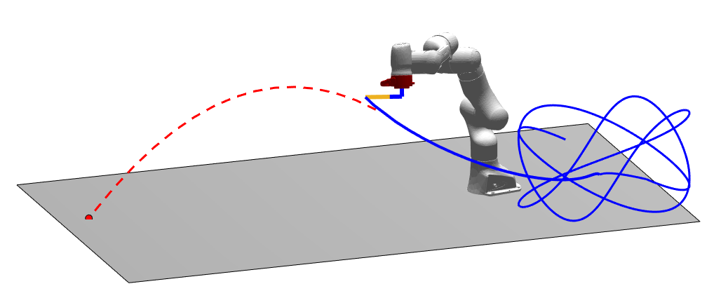

# [panda_mact_controller ](https://github.com/CentroEPiaggio/panda_mact_controller)



Here you can find a modified version of the adaptive computed torque control that does not require the mass matrix inversion in the parameters update law. The controller is compared against the classical adaptive computed torque control and the adaptive Slotine-li controller (Inertia-Related Control)

## Table of Contents
1. [Requirements](#requirements)
1. [Installation](#installation)
   1. `project-adaptive`
   1. `casadi`
   1. `yaml-cpp`
1. [ThunderPanda](#thunderpanda)
1. [Running controllers](#running-controllers)

## Requirements
* To test controllers in gazebo and/or RViz you need to install the package [franka_ros](https://github.com/frankaemika/franka_ros.git) in your workspace.
* To use the Franka robot you need the [FCI](https://frankaemika.github.io/docs/)
* To manage yaml files you have to install [yaml-cpp](https://github.com/jbeder/yaml-cpp.git).

## Installation
As every ROS package you have to compile it:

1. Clone the `panda_controllers` branch `adaptive_throw` to your Catkin Workspace, e.g. `~/catkin_ws`:
   ```
   cd ~/catkin_ws/src
   git clone --branch adaptive_throw https://github.com/CentroEPiaggio/panda_controllers.git
   ```

1. Compile the package using `catkin`:
   ```
   cd ~/catkin_ws
   catkin_make
   ```

## Running Controllers

* In [launch](./launch/) folder there is a launch file related to the spawning of controller `panda_controllers_sim.launch`, that is useful to set type of controller in gazebo and rviz visualization. If you want set up controllores in real robot you can use the file `controller.launch`